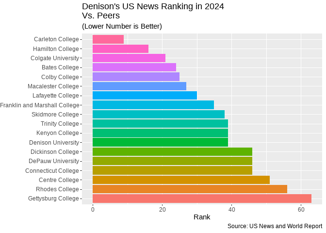

denisonbrand Package
================
Arthur Steinmetz (1980)

<!-- README.md is generated from README.Rmd. Please edit that file -->


## Overivew

This package is intended to help the Denison University community create
data visualizations using R code that is consistent with the Denison
University Branding Guidelines. It provides color palettes, fonts,
ggplot2 themes and graphic elements that are consistent with the
guidelines. It also provides an html style sheet for use in Rmarkdown
documents and Shiny apps.

This package is not a product of Denison University or sanctioned by the
school. It is a personal project of the author, who is an alumnus. It is
not intended to be a substitute for the official branding guidelines,
but rather a tool to help people create R project visualizations that
are consistent with the guidelines. The official branding guidelines are
at [denison.edu/brand](https://denison.edu/brand).

## Installation

First, install the package from GitHub (where you may also view the
source code) using the `remotes` package. The package is not yet on
CRAN.

``` r
remotes::install_github("apsteinmetz/denisonbrand")
```

## Usage

Load the package and install the fonts.

``` r
library(denisonbrand)
load_fonts()
#> [1] "Loading Google Fonts"
#> den_display_serif1 
#>             "Lora" 
#> den_display_sans 
#>         "Oswald" 
#> den_display_serif2 
#>      "Crimson Pro" 
#> den_text_sans 
#>   "Open Sans" 
#>      den_text_serif 
#> "Libre Caslon Text"
```

## Color Palettes

You have access to all the official Denison colors. The colors can be
referred to in palette groups or by their individual names.

`den_palettes` a list of palettes `den_colors` is a named vector of all
the colors

You can view the palettes and colors by using the `color_bars()`
function.

## The Fonts

Most of the official fonts are proprietary Adobe fonts and cannot be
used in this open-source package.

`den_font_map` contains a table showing the official font names, the
official sanctioned substitute fonts and the open source Google fonts
that are used in this package. Several are the sanctioned substitutes
and and some are the closest substitutes I could find.

``` r
den_font_map
#>   purpose      denison_font denison_alt google_substitute
#> 1 display Caslon Graphiqe D        Lora              Lora
#> 2 display             DINOT      Oswald            Oswald
#> 3 display        High Tower     Georgia       Crimson Pro
#> 4    text       FreightSans   Trebuchet         Open Sans
#> 5    text            Caslon     Georgia Libre Caslon Text
```

## ggplot2 Themes

The main purpose of this package is to support using `ggplot2` with
Denison brand colors and typefaces. `ggplot2` modifies plot elements
through two primary paths, data elements such as lines, points and bars,
and background elements such as axes, labels, legends, etc. The
`scale_*` functions are used to modify data elements, while the
`theme_*` functions are used to modify background elements. The
`denisonbrand` package provides `ggplot2` functions for both of these
and two somewhat non-standard meta functions to modify the data and
background in one go.

The important ggplot2 functions are:

`scalel_color_den()` for setting colors of line and scatter plots.

`scale_fill_denison()` for setting colors of bars and other filled
shapes.

`theme_den()` for setting background elements such as axes, labels,
legends, etc. in accordance with Denison colors and typefaces.

All of these work just like their ggplot2 equivalents,
`scale_fill_manual()`,`scale_color_manual()` and `theme()`. See the
`ggplot2` documentation and the `denisonbrand` vignette for specific
examples.

## An Example

First using `ggplot2` defaults.

``` r
library(ggplot2)
#> Warning: package 'ggplot2' was built under R version 4.3.1
library(dplyr)
#> Warning: package 'dplyr' was built under R version 4.3.1
#> 
#> Attaching package: 'dplyr'
#> The following objects are masked from 'package:stats':
#> 
#>     filter, lag
#> The following objects are masked from 'package:base':
#> 
#>     intersect, setdiff, setequal, union
library(forcats)

rank_data |> 
  filter(college %in% peer_schools_list) |> 
  filter(year == 2024) |>
  mutate(college = fct_reorder(college, rank,.desc = TRUE)) |> 
  ggplot(aes(college,rank, fill = college)) +
  geom_col()  +
  coord_flip() +
  labs(title = "Denison's US News Ranking in 2024\nVs. Peers",
       subtitle = "(Lower Number is Better)",
       caption = "Source: US News and World Report",
       x = NULL,
       y = "Rank") +
  #remove legend
  theme(legend.position = "none")
```

 Now with
Dension colors and fonts. The use of colors in this plot is kind of
gratuitous and just to show the palette.

``` r
library(denisonbrand)
library(ggplot2)
library(dplyr)
library(forcats)
load_fonts()
#> [1] "Loading Google Fonts"
#> den_display_serif1 
#>             "Lora" 
#> den_display_sans 
#>         "Oswald" 
#> den_display_serif2 
#>      "Crimson Pro" 
#> den_text_sans 
#>   "Open Sans" 
#>      den_text_serif 
#> "Libre Caslon Text"

rank_data |> 
  filter(college %in% peer_schools_list) |> 
  filter(year == 2024) |>
  mutate(college = fct_reorder(college, rank,.desc = TRUE)) |> 
  ggplot(aes(college,rank, fill = college)) +
  geom_col()  +
  scale_fill_den() +
  coord_flip() +
  labs(title = "Denison's US News Ranking in 2024\n Vs. Peers",
       subtitle = "(Lower Number is Better)",
       caption = "Source: US News and World Report",
       x = NULL,
       y = "Rank") +
  #remove legend
  theme_den(legend.position = "none")
```


## Further Work

I am not aware of any brand standards for plots formatting. Each
department seems to do whatever it likes. I’d like to see one standard,
though.

Also, I am thinking about the best way to provide easy access to logos
for plot decorations.
